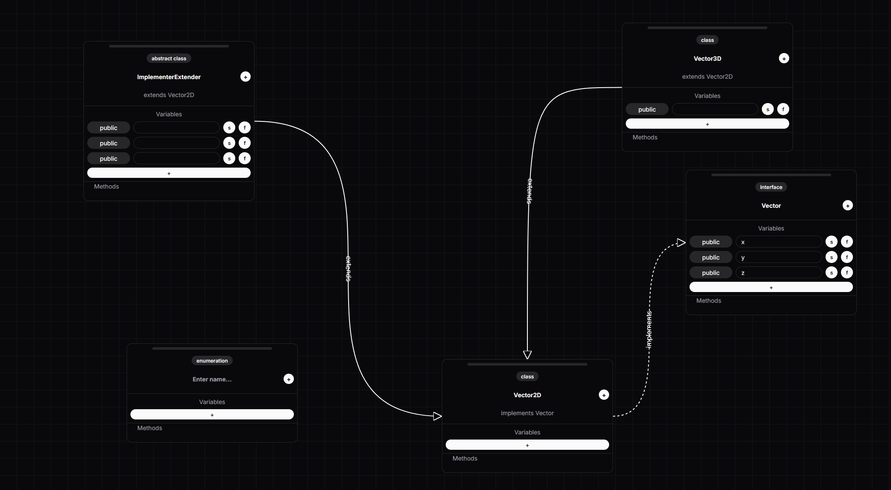

# Class Diagram Editor

An interactive, browser-based UML class diagram editor built with React and Next.js. Create, arrange, and connect classifier elements on an infinite canvas with pan and zoom.



## What It Does

This is a visual tool for designing object-oriented class structures. You can drag classifier cards around a grid-backed canvas, name them, add variables, and draw relationships between them.

**Supported classifiers:**

- Classes
- Abstract classes
- Interfaces
- Enumerations

**Supported relationships:**

- Extension (inheritance)
- Implementation (realization)
- Association (planned)

Connections are rendered as animated bezier curves with smart routing -- the app automatically picks the best exit and entry points on each card. Implementation lines are dashed, extension lines are solid, and labels like "implements" and "extends" follow the curves.

## Features

- Infinite canvas with pan (middle-mouse drag) and zoom (scroll wheel)
- Draggable classifier cards with editable names and variable sections
- Connection dropdowns that enforce UML rules (e.g., interfaces can only implement other interfaces)
- Keyboard shortcuts for quickly adding new classifiers
- Dark theme throughout
- Bezier arrow rendering with auto-rotated text labels

## Keyboard Shortcuts

| Shortcut | Action |
| --- | --- |
| Alt + A | Add abstract class |
| Alt + C | Add class |
| Alt + I | Add interface |
| Alt + E | Add enumeration |

## Tech Stack

- **React 18** with TypeScript
- **Next.js 14** (App Router)
- **Tailwind CSS** for styling
- **shadcn/ui** component library (Radix UI primitives)
- **Framer Motion** for animations

## Getting Started

```bash
npm install
npm run dev
```

Open [http://localhost:3000](http://localhost:3000) in your browser.

## Work in Progress

This project is still in early development. Here is what is not yet implemented or fully functional:

- **Methods section** -- The methods panel on each classifier card is a placeholder and does not yet support adding or editing methods.
- **Variable modifiers** -- The `static`, `final`, and `scope` fields exist in the data model but the UI toggles for them are not wired up yet.
- **Association connections** -- The data type is defined but association arrows are not rendered in the UI.
- **Composition and aggregation** -- Arrow markers are defined in the SVG defs but not used anywhere.
- **Save/load** -- There is no persistence, serialization, or export functionality.
- **Undo/redo** -- Not implemented yet.

The example diagram shown above demonstrates the current state: you can create classifiers, name them, add variables, and connect them with inheritance or implementation arrows.
